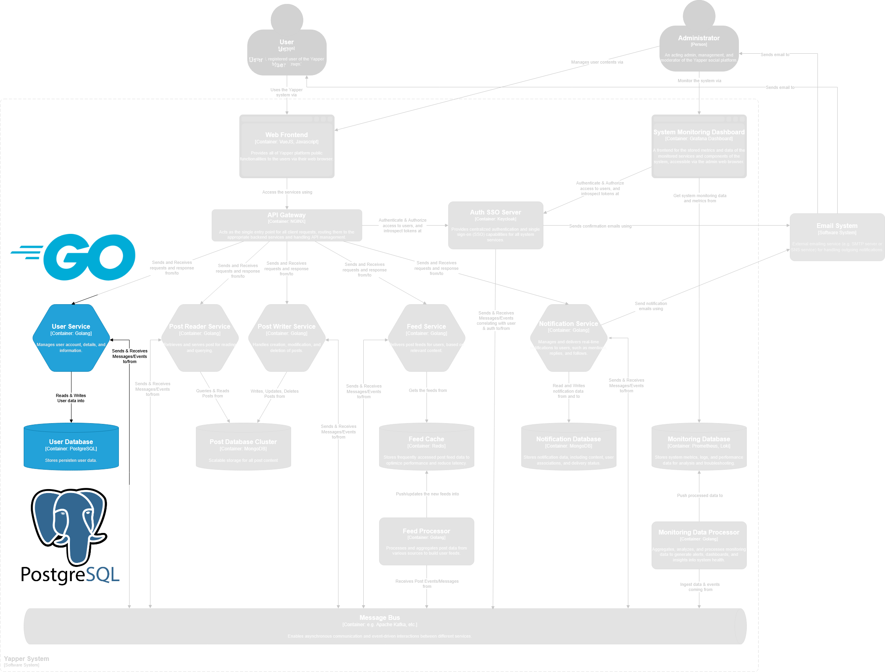

<div align="center">


> A simple social platform to view and post short text messages (Yaps).
> <br><small>(i.e., an X (Twitter), BlueSky, Threads clone)</small>

<a href="https://github.com/fateh-ark/yapper-frontend">Frontend</a> |
<a href="">Observability Stack</a><br>
<b>User Service</b> |
<a href="">Post Service</a> |
<a href="">Feed Service</a><br>
<a href="https://github.com/fateh-ark/yapper-middlewares">Middlewares</a>

</div>

---

#  Yapper User Service

This repository contains the source codes for the user service of Yapper! system and its database. Developed using Golang and Postgres. 

This service could be build and run locally for development or testing and does not need to have the other services installed or running in the environment



#### Relevant Documentations

- System Requirements Documentation
- Design Documentation

#### Open Issues

- [ ] Finish Readme Documentation
- [ ] Gitlab CI/CD Pipeline Setup

## Local Development & Testing

### Prerequisites

In order to deploy the services into your local environment, you must have the following set up or configured:

- Docker / Docker Desktop
- docker-compose version `2.24.0` or above

### Optional .env file

A `.env` file beside the docker-compose files can be optionally included for customization. All variables available to config already has default values. See [example.env](./example.env) on what can be configured.

### Build & Start

To run all of the services, run the following commnad:

``` sh
docker-compose up
```

If you only wanted to deploy only one of the service, include the `-f` flag followed by the docker-compose file you're trying to deploy. e.g:

``` sh
docker-compose -f docker-compose.gateway.yml up
```

### Teardown

To teardown the services, run the following command:

```sh
docker-compose down
```

To teardown a specific service if you only ran one of them, include the `-f` flag followed by the docker-compose file you're trying to deploy. e.g:

``` sh
docker-compose -f docker-compose.gateway.yml down
```

include the `-v` flag if you need to remove the created volumes as well.


## Cloud Deployment

TBA at a later sprint.
